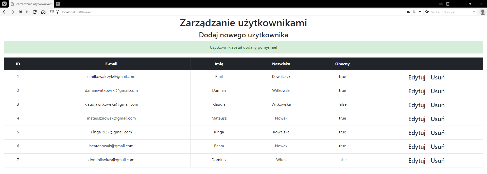
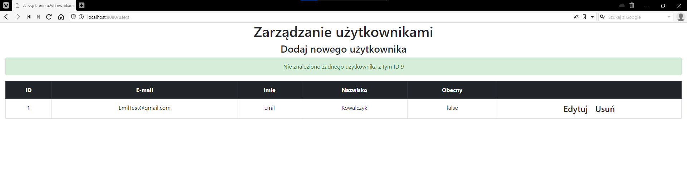
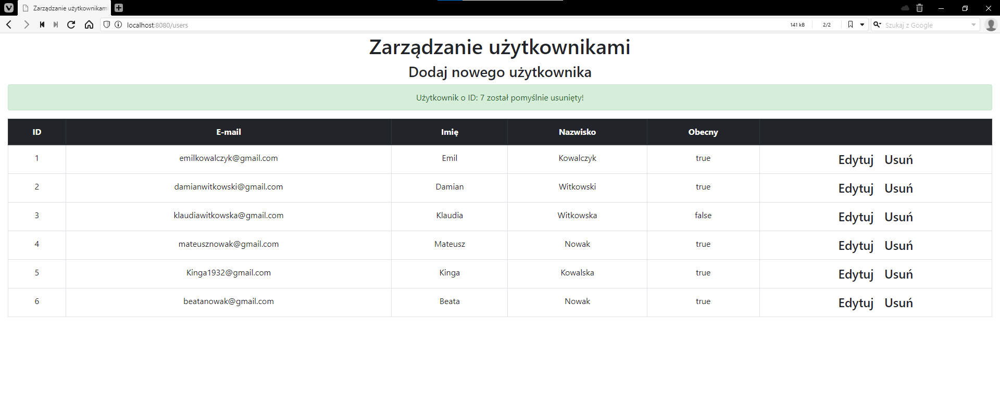

#  :computer: WebApplication 
### :ticket: Java / Spring Boot / Hibernate / HTML / Thymeleaf / Bootstrap / MySQL

#### A CRUD application whose purpose is to manage users.
# ------------------------------------------
#### :boom: Adding a new user :boom:

---------------------------------------------
#### :boom: Attempting to delete a user when they are not in the database :boom:

---------------------------------------------
#### :boom: Deletion of a user :boom:

